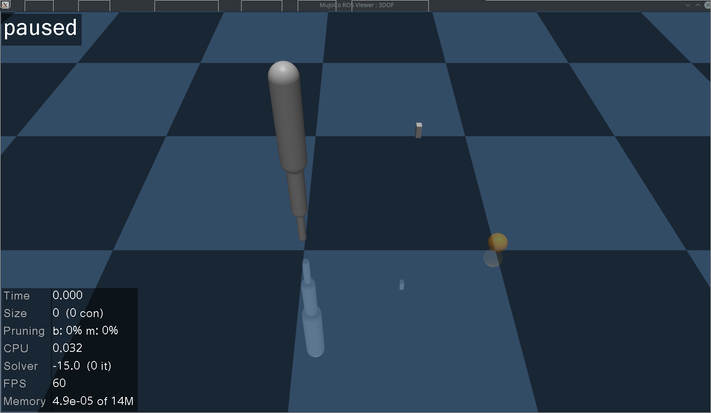

Gettings Started
================

Here you will setup an example environment that you can utilize in the other tutorials.

Install ROS (Noetic or One)
^^^^^^^^^^^^^^^^^^^^^^^^^^^

MuJoCo currently is supported for ROS Noetic running on Ubuntu Focal (20.04) and for ROS One running on Ubuntu Jammy (22.04). At this time we don't guarantee compatibility with other systems, though you still might be able to compile and run on a differing configuration.

.. tip:: How to install ROS One on Jammy: https://ros.packages.techfak.net/

.. hint:: We are working on a version supporting ROS 2!

Once you have ROS installed, make sure you have the most up to date packages: ::

    sudo rosdep init
    rosdep update
    sudo apt update
    sudo apt upgrade

Install catkin commandline tools for configuration and building of workspaces: ::

    sudo apt install python3-catkin-tools

Create a catkin workspace and install MuJoCo
^^^^^^^^^^^^^^^^^^^^^^^^^^^^^^^^^^^^^^^^^^^^

Create a new directory which will become your main workspace ::

    mkdir -p ~/mujoco_ws/src

Source the base ROS distribution ::

    source /opt/ros/noetic/setup.bash

Configure the previously created directory to be a catkin workspace ::

    cd ~/mujoco_ws
    catkin init && catkin config --install

Download a compatible MuJoCo release or clone the source repository with the corresponding tag. The current MuJoCo ROS build on our main branch ('noetic-devel') requires MuJoCo 2.3.6.

.. attention::
   if you are using colcon, don't run `catkin init`

If you choose to build from source, clone and build MuJoCo with the following commands: ::

    git clone https://github.com/deepmind/mujoco $HOME/mujoco -b 2.3.6 --depth 1
    mkdir ~/mujoco/build
    cd ~/mujoco/build
    cmake .. -DMUJOCO_BUILD_SIMULATE=OFF -DMUJOCO_BUILD_EXAMPLES=OFF -DCMAKE_INSTALL_PREFIX=$HOME/mujoco_ws/install -DCMAKE_BUILD_TYPE=Release

.. note:: You can change the build type to `Debug` or `RelWithDebInfo` for debugging purposes.

Download and Build the MuJoCo ROS Source Code
^^^^^^^^^^^^^^^^^^^^^^^^^^^^^^^^^^^^^^^^^^^^^

Move into your workspace and pull the code from GitHub: ::

    cd ~/mujoco_ws/src
    git clone https://github.com/uni-agni/mujoco_ros_pkgs -b noetic-devel --depth 1

.. warning:: MuJoCo ROS enables you to restart or (re)load models at runtime, which also resets the simulated time to 0. By default this is not fully supported by the ROS ecosystem and will result in e.g. action servers ignoring goals until the simulation time reaches the value of the reset (until this `PR`_ is merged)

To make action servers behave nicely with time resets, optionally add a forked actionlib version to your workspace: ::

    cd ~/mujoco_ws/src
    git clone https://github.com/rhaschke/actionlib -b noetic-devel --depth 1

The following command will install any package dependencies not already present in your workspace: ::

    cd ~/mujoco_ws
    sudo apt update
    rosdep install -r --from-paths src --ignore-src --rosdistro $ROS_DISTRO -y

Now that all dependencies are satisfied, we can move on an build the source code in the workspace: 

If you are using catkin, run ::

    catkin b

Otherwise, for colcon run ::

    colcon build

Upon successful completion of the build, you should be able to source the built workspace and run a sample MuJoCo ROS server: ::

    source ~/mujoco_ws/install/setup.bash
     roslaunch mujoco_ros launch_server.launch use_sim_time:=true

A window displaying the default testing simulation scene like below should now have opened

Next Step
^^^^^^^^^

Next, we'll learn how to :doc:`load a custom model </tutorials/load_custom_model/load_custom_model>`

.. _PR: https://github.com/ros/actionlib/pull/203
